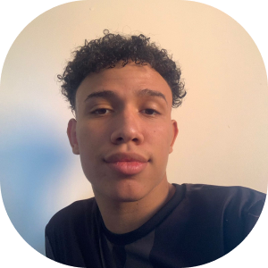
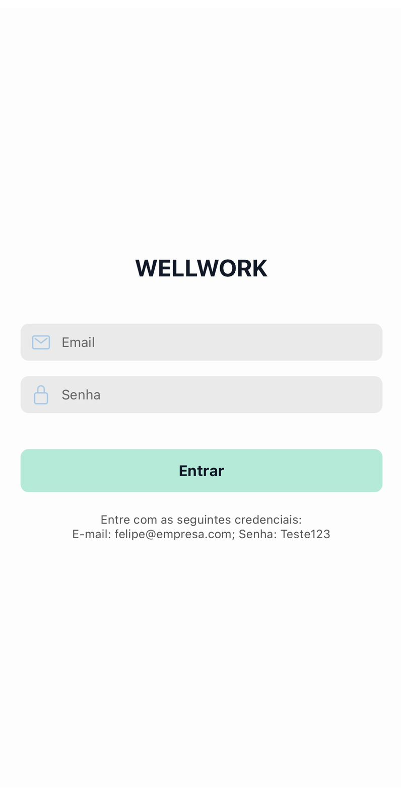
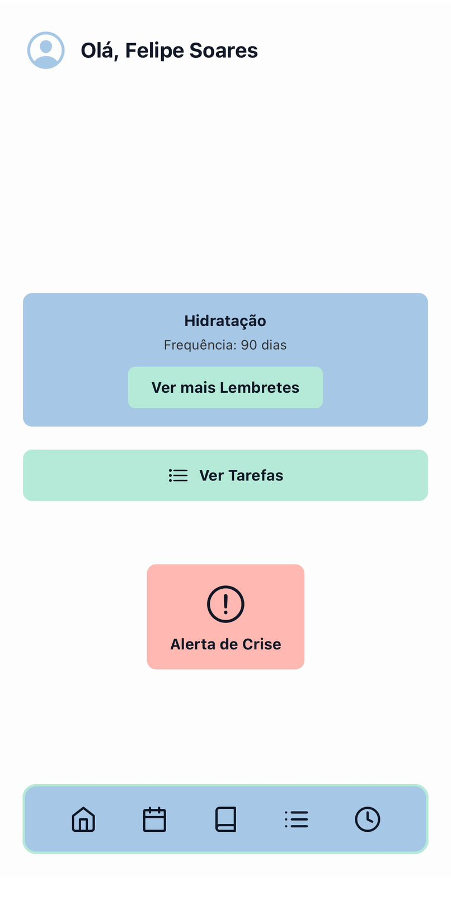
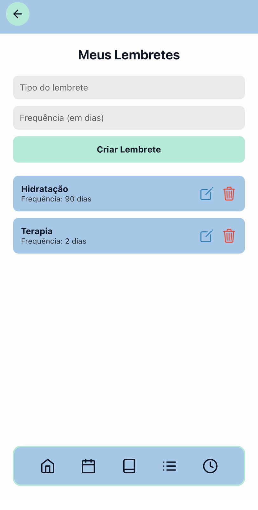
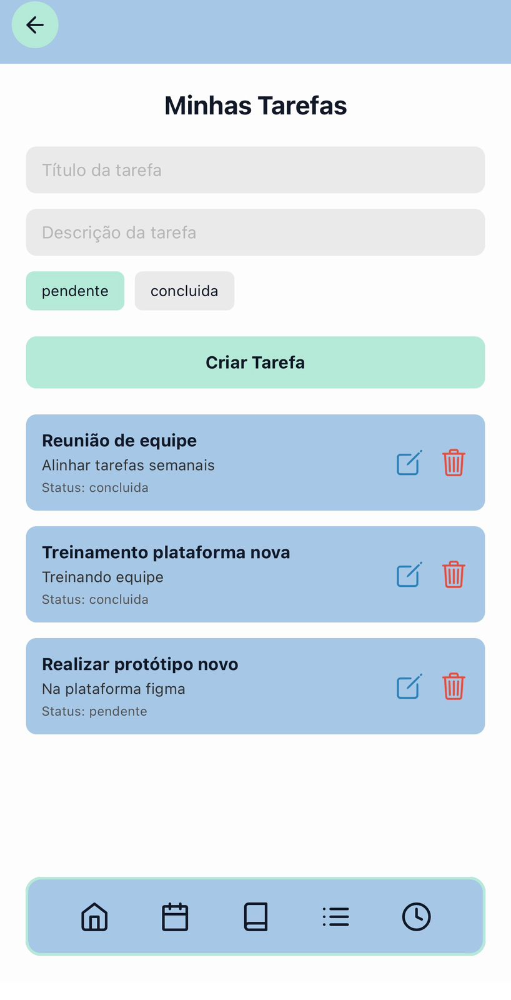
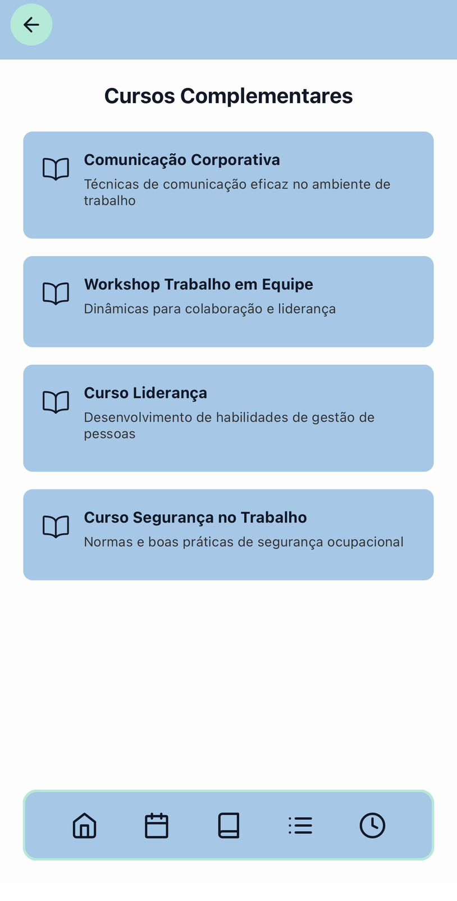
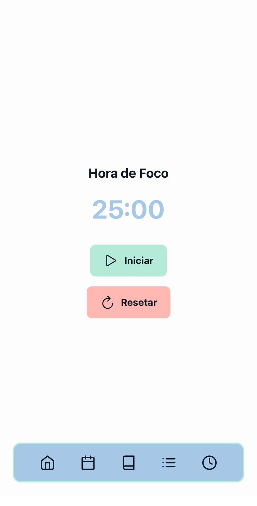
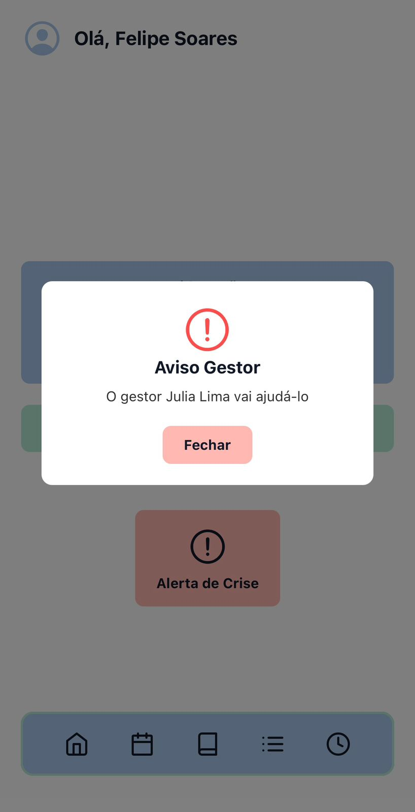
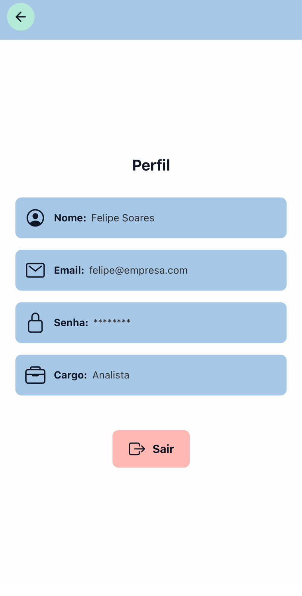

# WELLWORK 

## Integrantes

### 2TDSPR
|  |
|-------------------------------------------|
| 
Felipe Soares Gonçalves
|
| 
RM: 559175
|
| 
[GitHub](https://github.com/felipesoaresg)
|
| 
[Linkedin](https://www.linkedin.com/in/felipe-soares-40bb0125b/)
|

|  |
|-------------------------------------------|
| 
Henrique Batista de Souza
|
| 
RM: 99742
 |
| 
[GitHub](https://github.com/rickfiap)
|
| 
[Linkedin](https://www.linkedin.com/in/henriquebatistadev/)
|

|  |
|-------------------------------------------|
| 
Julia Lima Rodrigues
|
| 
RM: 559781
 |
| 
[GitHub](https://github.com/juliafiap)
|
| 
[Linkedin](http://www.linkedin.com/in/julia-rodrigues-a12a3924b)
|

## Descrição do Projeto
O ambiente de trabalho moderno, especialmente nos formatos remoto e híbrido, traz desafios significativos para pessoas neurodivergentes ou com deficiência. A falta de acessibilidade digital, excesso de estímulos, dificuldades de organização, comunicação pouco inclusiva e ausência de suporte personalizado geram sobrecarga, queda de produtividade e aumento de estresse. Atualmente, muitos trabalhadores com doenças neurodivergentes não encontram ferramentas que realmente atendam suas necessidades específicas. As soluções existentes são fragmentadas, complexas ou não utilizam design universal e práticas de acessibilidade. Isso reduz a inclusão no ambiente profissional e compromete oportunidades de desenvolvimento e bem-estar.

## Vídeo apresentando projeto 
<a href='https://youtu.be/5d2Hn9P9Ses'>WellWork Apresentação</a>

## Estrutura do Projeto
Aqui estão as seções principais da nossa apresentação. As imagens abaixo representam telas e fluxos da aplicação.

|        |        |
|-------------------------------------------|---------------------------------------------|
| 
Tela de Login
       | 
Tela Principal
      |

|     |    |
|-------------------------------------------|---------------------------------------------|
| 
Tela de Lembretes
 | 
Tela de Tarefas
 |

|    |           |
|-------------------------------------------|---------------------------------------------|
| 
Tela para Cursos
   | 
Tela de Foco
       |

|    |           |
|-------------------------------------------|---------------------------------------------|
| 
Tela de Avisos
   | 
Tela de Usuário
       |

## Tecnologias Utilizadas

  
  
  

